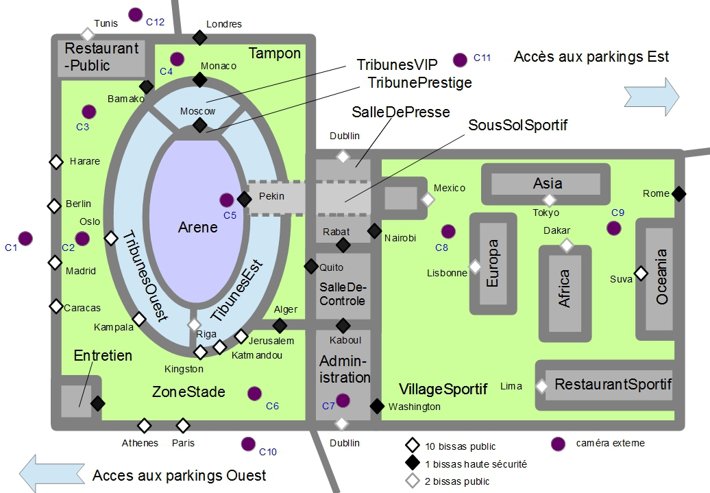
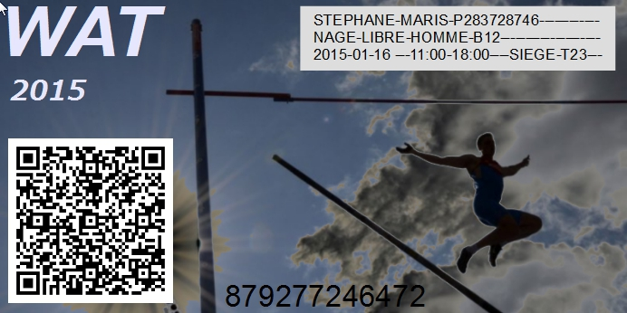

CR007
=====

:Date: 2015-02-02-8h-8h30
:Type: Scenario
:PartiesPrenantes: ABI, KWG, PPS
:Organisateur: ABI
:Rapporteur: KWG
:Presents: ABI, PPS, KWG
:Objectifs: Etablir un scénario de vente
:Contenu:

    Fig1: "Paraguana", un exemple de *site* devant être géré par CyberCompetition

    Fig2: "C4 - CILINDRO BIBUSSOLA" par `AllUserIndustrie <http://www.archiexpo.com/prod/alluser-industrie/sliding-doors-commercial-buildings-security-automatic-52110-624140.html#product-item_142100>`__, similaire au bissas qui seront utilisés par CyberCompétition

.. figure:: media/bissas-video.mp4

    Exemple de *billet* devant être émis par CyberCompetition
    http://www.archiexpo.com/prod/alluser-industrie/sliding-doors-commercial-buildings-security-automatic-52110-624140.html#product-item_142100

    Fig3: Exemple de *billet* devant être émis par CyberCompetition

